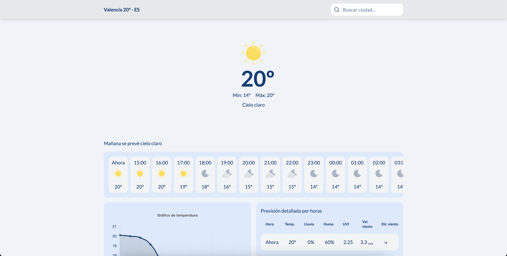
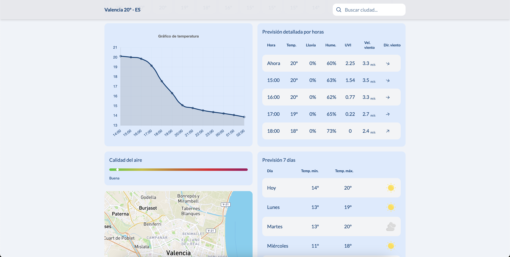
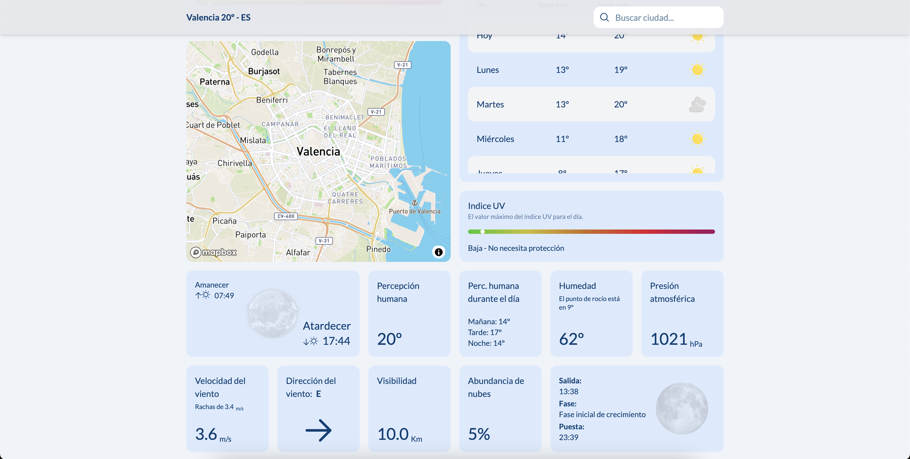
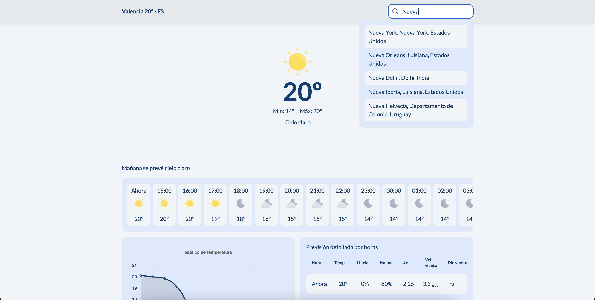
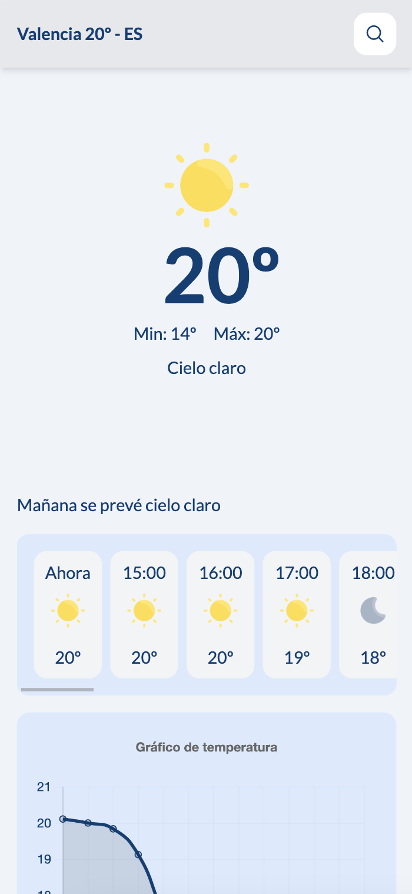
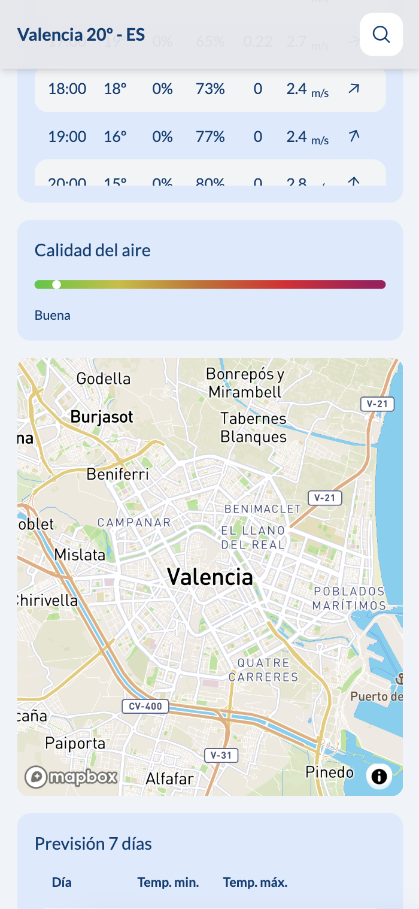
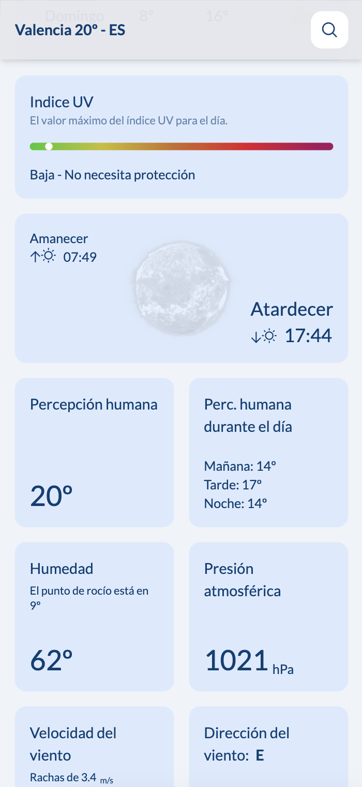
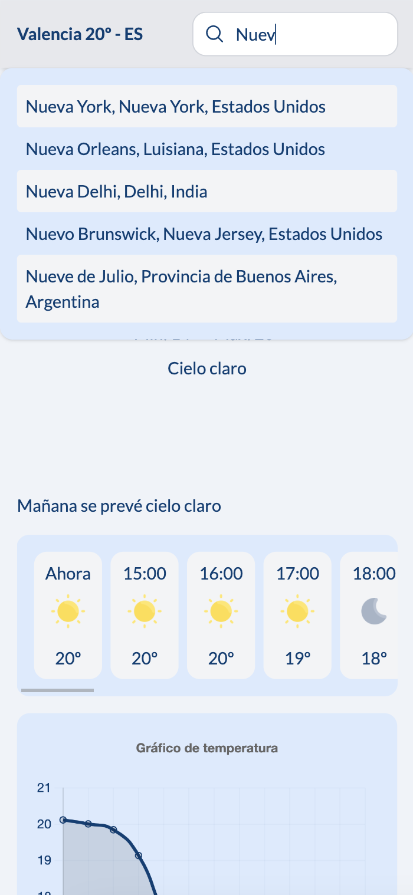

# React + TypeScript + Vite + PrimeReact + Tailwind CSS

[](https://app.netlify.com/sites/s-mandola-weather-app/deploys)

> [👉 Watch live](https://s-mandola-weather-app.netlify.app/)

 
<!-- TOC -->
* [React + TypeScript + Vite + PrimeReact + Tailwind CSS](#react--typescript--vite--primereact--tailwind-css)
  * [APIs](#apis)
  * [Dev mode](#dev-mode)
  * [Screenshots](#screenshots)
    * [Desktop](#desktop)
    * [Mobile](#mobile)
<!-- TOC -->


 
## APIs

- [Open weather map](https://openweathermap.org/)
- [Mapbox](https://www.mapbox.com/)

## Dev mode

Install

``
npm install
``

You need .env variables:

```
VITE_API_BASE_URL_OPENWEATHER=
VITE_APP_ID_OPENWEATHER=
VITE_API_BASE_URL_MAPBOX=
VITE_MAPBOX_PK=
```

Run

``
npm run dev
``

Open: [localhost:5173](http://localhost:5173/)

## Screenshots

### Desktop





### Mobile




